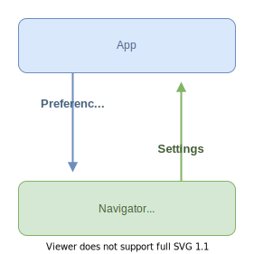

# Configuring the Navigator

:warning: The Navigator Setting API is still experimental and currently only available with `EpubNavigatorFragment`.

Take a look at the [migration guide](../migration-guide.md) if you are already using the legacy EPUB settings.

## Overview

A few Readium components – such as the Navigator – support dynamic configuration through the `Configurable` interface. It provides an easy way to build a user settings interface and save user preferences as a JSON object.

The application cannot explicitly set the Navigator settings. Instead, you can submit a set of `Preferences` to the Navigator (`Configurable`) which will in turn recompute its settings and refresh the presentation. Then, the application can update its user settings interface with the new settings emitted by the Navigator.

For a concrete example: "font size" is a **setting**, the application can submit the font size value `150%` which is a **preference**.



```kotlin
// 1. Get the current Navigator settings.
val settings = navigator.settings.value

// 2. Create a new set of preferences.
val preferences = Preferences {
    set(settings.fontFamily, FontFamily.SERIF)
    increment(settings.fontSize)
    toggle(settings.publisherStyles)
}

// 3. Submit the preferences, the Navigator will in turn update its settings. 
navigator.submitPreferences(preferences)
```

### Settings

The `Settings` (*plural*) object is unique for each Navigator implementation and holds the currently available `Setting` (*single*) properties. Each `Setting` object represents a single configurable property of the Navigator, such as the font size or the theme. It holds the current value of the setting, as well as additional metadata and constraints depending on the setting type.

Here are some of the available setting types:

* `ToggleSetting` - a simple boolean setting, e.g. whether or not the publisher styles are enabled.
* `RangeSetting<V>` - a setting for numbers constrained in a range, e.g. the page margins as a `RangeSetting<Int>` could range from 0px to 200px.
* `PercentSetting` - a specialization of `RangeSetting<Double>` which represents a percentage from, by default, 0.0 to 1.0.
* `EnumSetting<V>` - a setting whose value is a member of the enum `V`, e.g. the theme (`light`, `dark`, `sepia`) or the font family.

#### `Setting` objects are low-level

The `Setting` objects are technical low-level properties. While some of them can be directly exposed to the user, such as the font size, other settings should not be displayed as-is.

For example in EPUB, we simulate two pages side by side with `columnCount` (`auto`, `1`, `2`) for reflowable resources and `spread` (`auto`, `landscape`, `both`, `none`) for a fixed layout publication. Instead of showing both settings with all their possible values in the user interface, you might prefer showing a single switch button to enable a dual-page mode which will set both settings appropriately.

### Preferences

The `Preferences` object holds the values which should be preferred by the Navigator when computing its `Settings`. Preferences can be combined by the app from different sources:

* Static app defaults.
* User preferences restored from JSON.
* User settings interface.

#### Inactive settings

A setting can be inactive if its activation conditions are not met in a set of preferences. The Navigator will ignore inactive settings when refreshing its presentation. For instance with the EPUB navigator, the word spacing setting requires the publisher styles to be disabled to take effect.

You can check if a setting is active with:

```kotlin
preferences.isActive(settings.wordSpacing)
```

To force activate a setting, use `MutablePreferences.activate()` which will automatically reset the other preferences to the required values.

```kotlin
val updatedPreferences = preferences.copy {
    activate(settings.wordSpacing)
}
```

:point_up: For convenience, settings are force activated by default when set in a `MutablePreferences`. This helps the user see the impact of a setting right away, when changing it in the user interface. If you wish to set a preference without modifying the other ones, set the `activate` parameter to `false`.

```kotlin
preferences.copy {
    set(settings.fontFamily, FontFamily.SERIF, activate = false)
    increment(settings.fontSize, activate = false)
    toggle(settings.publisherStyles, activate = false)
}
```

## Setting the initial Navigator preferences and app defaults

When opening a publication, you want to apply the user preferences right away. You can do that by providing them to the Navigator constructor. The API depends on each Navigator implementation, but looks like this:

```kotlin
EpubNavigatorFragment.createFactory(
    publication = publication,
    ...,
    config = EpubNavigatorFragment.Configuration(
        preferences = preferences,
        defaultPreferences = Preferences {
            set(EpubSettings.scroll, true)
        }
    )
)
```

The `defaultPreferences` are used as fallback values when the default Navigator settings are not suitable for your application.

:point_up: When you don't have access to an `EpubSettings` instance, the "prototype" settings (e.g. `EpubSettings.SCROLL`) are helpful to modify a `Preferences` object.

## Build a user settings interface

:question: The following examples are using [Jetpack Compose](https://developer.android.com/jetpack/compose), but could be implemented with regular Android views.

You can use the `Configurable` API to build a user settings interface dynamically. As this API is agnostic to the type of publication, you can reuse parts of the user settings screen across Navigator implementations or media types.

For example, you could group the user settings per nature of publications:

* `ReflowableUserSettings` for a visual publication with adjustable fonts and dimensions, such as a reflowable EPUB, HTML document or PDF with reflow mode enabled.
* `FixedLayoutUserSettings` for a visual publication with a fixed layout, such as FXL EPUB, PDF or comic books.
* `PlaybackUserSettings` for an audiobook, text-to-speech or EPUB media overlays settings.

### Binding with the `Configurable` Navigator

This first [stateful composable](https://developer.android.com/jetpack/compose/state#stateful-vs-stateless) binds directly with a `Configurable` object to recompose when its settings are refreshed and to apply the preferences when the user interacts with the interface. It delegates the actual interface to a stateless `UserSettings` composable.

```kotlin
if (navigator is Configurable<*>) {
    UserSettings(navigator)
}

@Composable
fun UserSettings(configurable: Configurable<*>) {
    val settings by configurable.settings.collectAsState()
    var preferences by remember { mutableStateOf(Preferences()) }

    UserSettings(
        settings = settings,
        preferences = preferences,
        edit = { changes ->
            preferences = preferences.copy(changes)
            configurable.submitPreferences(preferences)
        }
    )
}
```

:point_up: A real application would hoist the state in a separate object (such as an Android `ViewModel`) to save and restore the user preferences and update itself when the Navigator is recreated (e.g. configuration change). Take a look at `UserSettingsViewModel.kt` and `UserSettings.kt` in the Test App for a real example.

The `edit` parameter is a closure with the declared type:

```kotlin
typealias EditPreferences = (MutablePreferences.() -> Unit) -> Unit
```

It is used to conveniently modify the current preferences and apply them to the `Configurable` in the stateless composables. For example:

```kotlin
edit {
    // `this` is now a MutablePreferences

    increment(settings.fontSize)
}
```

### Stateless `UserSettings` composable

`Configurable.Settings` is just an empty [marker interface](https://en.wikipedia.org/wiki/Marker_interface_pattern). To access the actual `Setting` properties, you need to cast it to a concrete implementation (e.g. `EpubSettings`) and decide on the best kind of user settings screen for it.

```kotlin
@Composable
fun UserSettings(
    settings: Configurable.Settings,
    preferences: Preferences,
    edit: EditPreferences
) {
    Column {
        Text("User settings")

        // Button to reset the preferences using [MutablePreferences.clear].
        Button(
            onClick = {
                edit { clear() }
            },
        ) {
            Text("Reset")
        }

        Divider()

        when (settings) {
            is EpubSettings ->
                ReflowableUserSettings(
                    preferences = preferences,
                    edit = edit,
                    publisherStyles = settings.publisherStyles,
                    fontSize = settings.fontSize,
                    font = settings.font,
                )
        }
    }
}
```

:question: The individual `EpubSettings`' `Setting` properties are forwarded to `ReflowableUserSettings` to be able to reuse it with other reflowable publication types.

### User settings composable for reflowable publications

This stateless composable displays the actual settings for a reflowable publication. The `Setting` parameters are nullable as they might not be available at all times or for all media types. It delegates the rendering of individual settings to specific composables.

```kotlin
@Composable
fun ReflowableUserSettings(
    preferences: Preferences,
    edit: EditPreferences,
    publisherStyles: ToggleSetting? = null,
    fontSize: PercentSetting? = null,
    font: EnumSetting<Font>? = null,
) {
    if (publisherStyles != null) {
        SwitchItem("Publisher styles", publisherStyles, preferences, edit)
    }

    if (fontSize != null) {
        StepperItem("Font size", fontSize, preferences, edit)
    }

    if (font != null) {
        MenuItem("Font", font, preferences, edit) { value ->
            when (value) {
                Font.ORIGINAL -> "Original"
                else -> font.label(value)
            } ?: "Unknown"
        }
    }
}
```

### Composable for a `ToggleSetting`

A `ToggleSetting` can be represented as a simple switch button.

```kotlin
@Composable
fun SwitchItem(
    title: String,
    setting: ToggleSetting,
    preferences: Preferences,
    edit: EditPreferences
) {
    ListItem(
        modifier = Modifier
            .clickable {
                edit { toggle(setting) }
            },
        text = { Text(title) },
        trailing = {
            Switch(
                checked = preferences[setting] ?: setting.value,
                onCheckedChange = { checked ->
                    edit { set(setting, checked) }
                }
            )
        }
    )
}
```

This composable takes advantage of the helpers in `MutablePreferences` to set the preference in two different ways:

* `toggle(setting)` will invert the current preference when tapping on the whole list item.
* `set(setting, checked)` sets an explicit value provided by the `Switch`'s `onCheckedChange` callback.

:point_up: Note that the current state for `Switch` is derived from the selected preference first, and the actual setting value as a fallback (`checked = preferences[setting] ?: setting.value`). We deemed more important to display the user selected value first, even if it is not applied yet in the Navigator. Your opinion may differ, in which case you can use `checked = setting.value`.

### Composable for a `PercentSetting`

A `PercentSetting` (or any `RangeSetting<V>`) can be represented as a stepper component with decrement and increment buttons.

```kotlin
@Composable
fun StepperItem(
    title: String,
    setting: RangeSetting<Double>,
    preferences: Preferences,
    edit: EditPreferences,
) {
    ListItem(
        text = { Text(title) },
        trailing = {
            Row {
                IconButton(
                    onClick = {
                        edit { decrement(setting) }
                    }
                ) {
                    Icon(Icons.Default.Remove, contentDescription = "Less")
                }

                val currentValue = preferences[setting] ?: setting.value
                Text(setting.label(currentValue))

                IconButton(
                    onClick = {
                        edit { increment(setting) }
                    }
                ) {
                    Icon(Icons.Default.Add, contentDescription = "More")
                }
            }
        },
    )
}
```

This composable uses the `increment()` and `decrement()` range helpers of `MutablePreferences`, but you could also set a value manually.

Between the two buttons, we display the current value using the `RangeSetting<V>.label()` helper. This will automatically format the value to a human-readable string, such as a percentage or a value with units (e.g. 30px).

### Composable for an `EnumSetting<V>`

An enum can be displayed with various components, such as:

* a dropdown menu for a large enum
* [segmented buttons](https://m3.material.io/components/segmented-buttons/overview) for a small one

In this example, we chose a dropdown menu built using the `setting.values`, which returns the allowed enum members.

```kotlin
@Composable
fun <T> MenuItem(
    title: String,
    setting: EnumSetting<T>,
    preferences: Preferences,
    edit: EditPreferences,
    label: (T) -> String
) {
    val currentValue = preferences[setting] ?: setting.value

    ListItem(
        text = { Text(title) },
        trailing = {
            DropdownMenuButton(
                text = { Text(label(currentValue)) }
            ) {
                for (value in setting.values) {
                    DropdownMenuItem(
                        onClick = {
                            edit { set(setting, value) }
                        }
                    ) {
                        Text(label(value))
                    }
                }
            }
        },
    )
}

@Composable
fun DropdownMenuButton(
    text: @Composable RowScope.() -> Unit,
    content: @Composable ColumnScope.(dismiss: () -> Unit) -> Unit
) {
    var isExpanded by remember { mutableStateOf(false) }
    fun dismiss() { isExpanded = false }

    OutlinedButton(
        onClick = { isExpanded = true },
    ) {
        text()
        DropdownMenu(
            expanded = isExpanded,
            onDismissRequest = { isExpanded = false }
        ) {
            content(::dismiss)
        }
    }
}
```

`EnumSetting<V>` also offers a `label()` helper to generate a user-facing string for each value. However, you will need a fallback mechanism as the returned string is nullable, since some enums need localized values (e.g. text alignment).

## Save and restore the user preferences

Having a user settings screen is moot if you cannot save and restore the selected preferences for future sessions. Thankfully you can serialize `Preferences` to a JSON object.

```kotlin
val json = preferences.toJsonString()
```

When you are ready to restore the user preferences, construct a new `Preferences` object from the JSON string.

```kotlin
val preferences = Preferences.fromJson(json)
```

In the Test App, `UserSettingsViewModel` delegates the preferences state hoisting and persistence to `PreferencesStore`, which acts as a single source of truth.

### Splitting and merging preferences

How you store user preferences has an impact on the available features. You could have, for example:

* A different unique set of preferences for each publication.
* Preferences shared between publications with the same profile or media type (EPUB, PDF, etc.).
* Global preferences shared with all publications (e.g. theme).
* Several user setting profiles/themes that the user can switch to and modify independently.
* Some settings that are not stored as JSON and will need to be reconstructed (e.g. the publication language).

Use the `filter` and `filterNot` API to extract settings from a `Preferences` object. You can then combine them with the `+` operator.

```kotlin
val appPrefs = prefs.filter(settings.theme)
val bookPrefs = prefs.filter(settings.language, settings.readingProgression)
val profilePrefs = prefs.filterNot(settings.theme, settings.language, settings.readingProgression)

val combinedPrefs = appPrefs + profilePrefs + bookPrefs
```

### Settings scoped to a publication

:warning: Some settings are really tied to a particular publication and should never be shared between several publications, such as the language. It's recommended that you store these settings separately per book.

While you can filter such settings explicitly, Readium offers a list of known publication-scoped settings with `Setting.PUBLICATION_SETTINGS`. Take a look at `PreferencesStore` in the Test App for an example.

```kotlin
// Filter the preferences that are related to the publication.
val bookPrefs = prefs.filter(*Setting.PUBLICATION_SETTINGS)
// Filter the preferences that will be shared between publications of the same profile.
val profilePrefs = prefs.filterNot(*Setting.PUBLICATION_SETTINGS)
```
