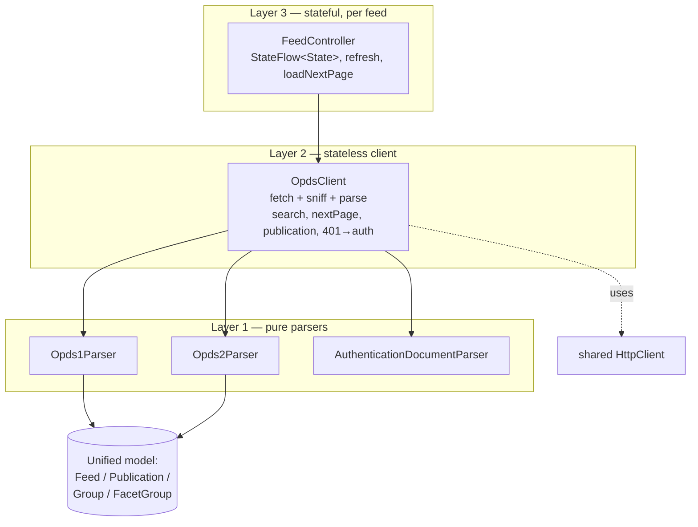
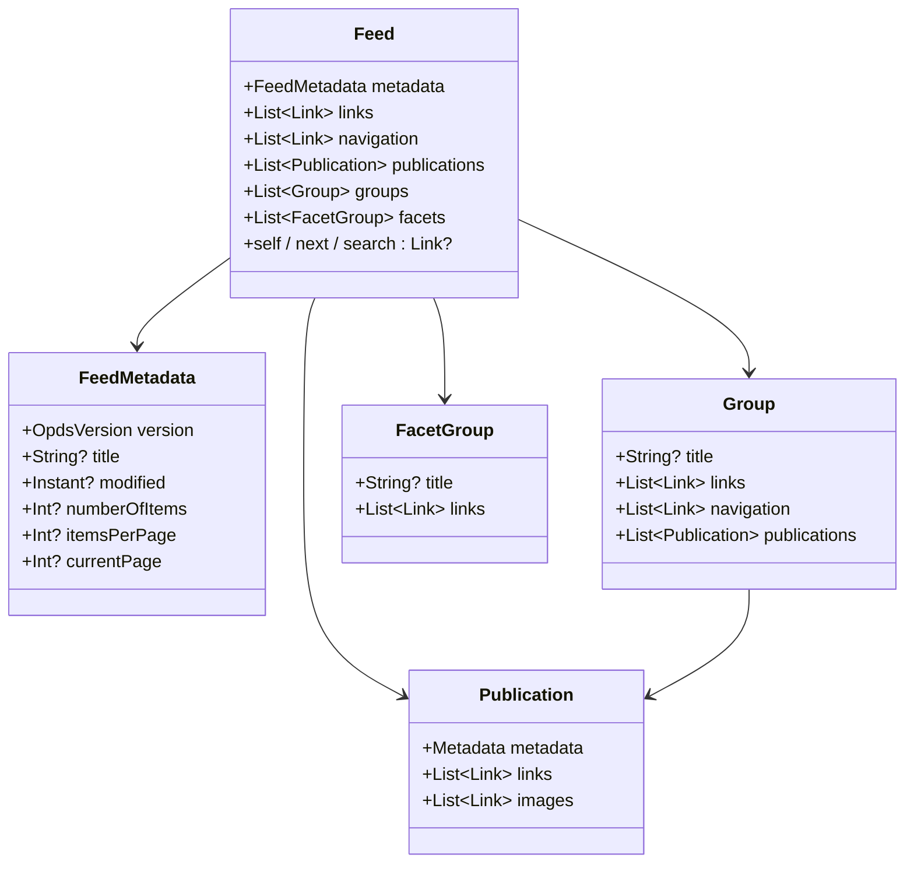
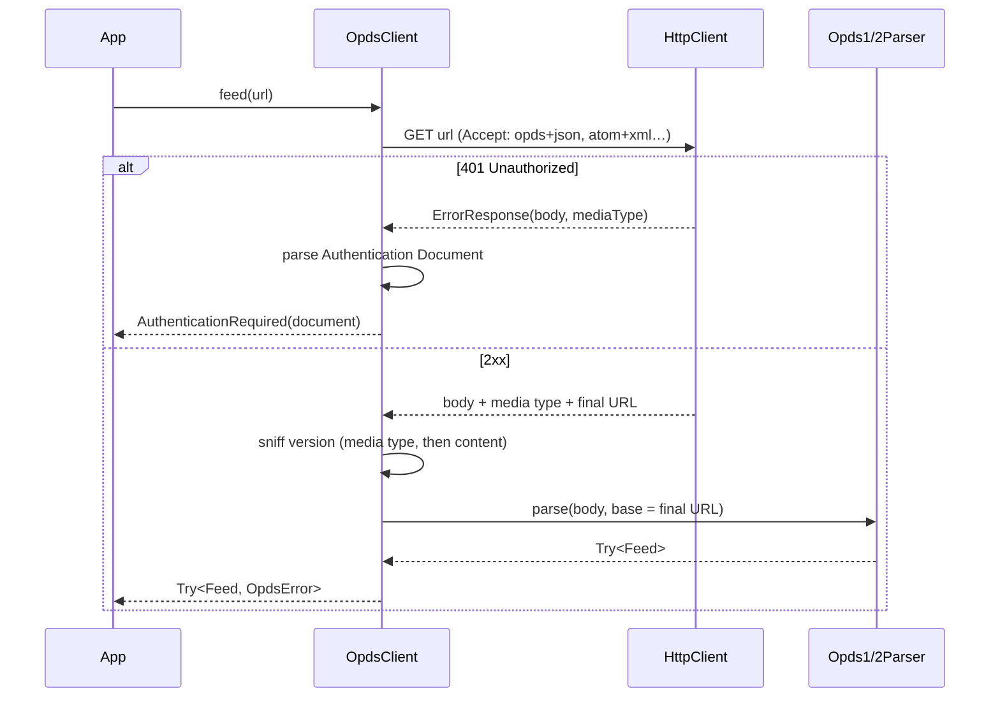
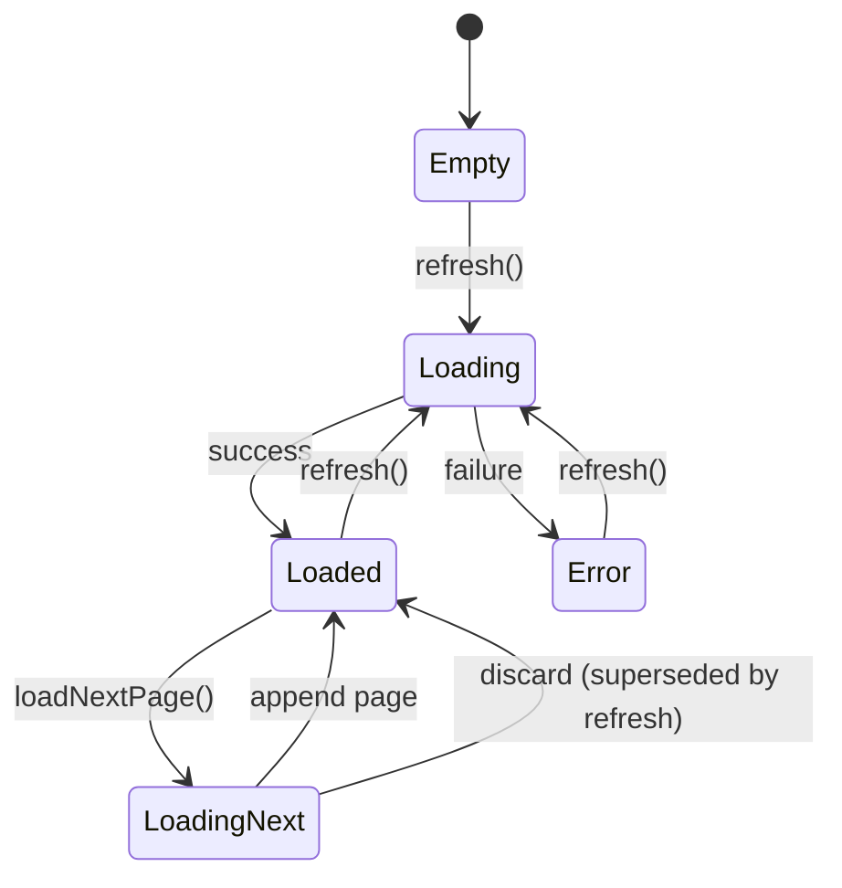

# OPDS Catalog Module (`org.readium.opds`)

A KMP-ready OPDS implementation that parses and browses both OPDS 1 (Atom/XML) and
OPDS 2 (JSON) catalogs behind a single unified, OPDS 2-shaped model. It lives in the
`readium/opds` module under the new `org.readium.opds` package and supersedes the legacy
`org.readium.r2.opds` parsers.

All public API is annotated `@ExperimentalReadiumApi`.

## Design at a glance

- **One model, two formats.** OPDS 1 is mapped onto the OPDS 2-shaped model at parse
  time. A `Feed` always reports which `OpdsVersion` it came from.
- **Shared types, new parsers.** Publication entries reuse the shared `Metadata`, `Link`,
  `Contributor`, `Subject`, and `Properties` types (and their OPDS `Properties` getters),
  but parsing is done with the kotlinx-serialization `JsonElement` tree API — no `org.json`,
  no compiler plugin.
- **Lenient by default.** Malformed items are dropped with a warning via the shared
  `WarningLogger`; only unparseable documents or non-OPDS payloads fail hard.
- **KMP-ready, Android-now.** Written in the target style (tree-API parsers, no direct
  Android imports) so the move to `commonMain` is a mechanical conversion later.

## Three layers

Each layer is usable on its own.



1. **Pure parsers** — bytes/string + a base `Url` → `Try<_, OpdsParseError>`. No I/O.
2. **`OpdsClient`** — stateless; fetches over a shared `HttpClient`, sniffs the version,
   parses, and offers unified `search`, `nextPage`, `publication`, and 401 → Authentication
   Document handling.
3. **`FeedController`** — one instance per feed; exposes a `StateFlow<State>` with
   `refresh()` and `loadNextPage()` accumulation. It owns no history — the app's navigation
   stack does.

## The unified model



Notes:

- `Metadata` is the shared publication type; `Instant` is `kotlin.time.Instant`, matching it.
- A `FacetGroup` has a title plus facet links; the active facet is marked with rel `self`,
  and its count lives in `properties.numberOfItems`.
- Acquisition data (price, holds, copies, availability, indirect acquisitions) is stored as
  **plain Kotlin values** in `Link.properties.otherProperties` so the existing shared
  `Properties` getters keep working unchanged.

## Fetching a feed with `OpdsClient`

The client resolves a URL to a fully-parsed `Feed`, detecting the format on the way and
turning a `401` into a parsed Authentication Document.



### Version sniffing

1. **Media type** first: `OPDS2`, `OPDS2_PUBLICATION`, `OPDS1`, `OPDS1_ENTRY`,
   `OPDS_AUTHENTICATION`.
2. **Content fallback** when the media type is generic: skip a BOM and leading whitespace,
   then dispatch on the first significant byte — `{` inspects JSON keys
   (`authentication` → auth doc; `navigation`/`publications`/`groups`/`facets` → feed;
   `metadata`+`links` → publication); `<` inspects the root element (`feed` / `entry`).
3. **Base URL** for href resolution is the final response URL, unless a valid absolute
   `rel=self` in the document overrides it.

## Search

`OpdsClient.search(feed, query)` is unified across both formats:

- **OPDS 2** — expands the templated `search` link using its actual variable name(s) via
  `Href.parameters` (catalogs use `{?query}`, `{?q}`, `{?searchTerms}`, …), then
  `Href.resolve`. Values are percent-encoded by the shared `URITemplate`.
- **OPDS 1** — fetches the `rel=search` OpenSearch description, picks the best `<Url>`
  template (opds profile > atom > any), and substitutes `{searchTerms}` with the
  query percent-encoded for the query component.

## `FeedController` state & pagination

`FeedController` holds accumulated feed content and serializes its state transitions with a
`Mutex`; network fetches run **outside** the lock so a slow page load never blocks a refresh.



Merge rules for `loadNextPage()`:

- `publications` / `navigation` / `groups` are **appended**.
- `metadata` and `links` are **replaced** by the latest page, so `currentPage` and `next`
  stay truthful (`hasNextPage = latest.next != null`).
- `facets` are replaced only when the new page carries any (some catalogs send them on
  page 1 only).

Ordering is protected with a **generation token**: `refresh()` increments it, and a page
load whose captured generation no longer matches on completion is discarded — so a stale
page can never be appended onto a freshly refreshed feed.

## Errors & warnings

```kotlin
sealed class OpdsParseError : Error { MalformedDocument; NotAnOpdsDocument }

sealed class OpdsError : Error {
    Http(cause)                       // network / HTTP failure
    AuthenticationRequired(document)  // 401 with a parsed Authentication Document
    Parsing(cause: OpdsParseError)
    SearchNotSupported
    NoNextPage
}
```

Recoverable problems (a publication missing its link, a group missing its title, a missing
self link) are reported through a shared `WarningLogger` and never abort parsing.

## Authentication

Authentication for OPDS 1.0 is **parsed and modelled only** — no credential storage or
flows. A `401` surfaces as `OpdsError.AuthenticationRequired`, carrying the parsed
`AuthenticationDocument` (id, title, a list of authentication `Flow`s, description, links).
