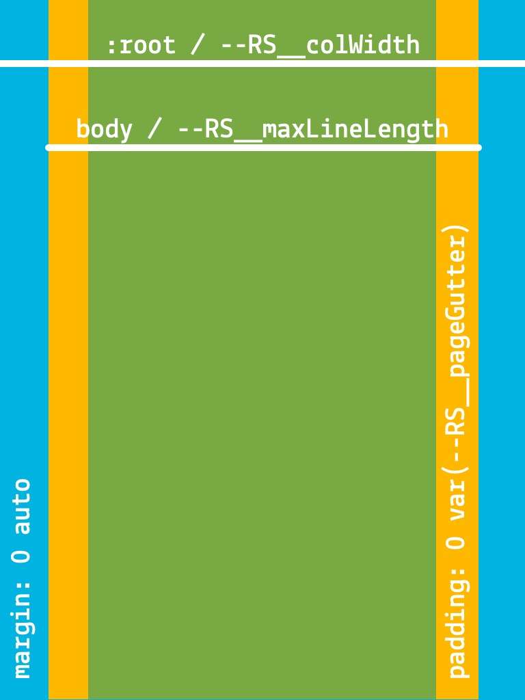
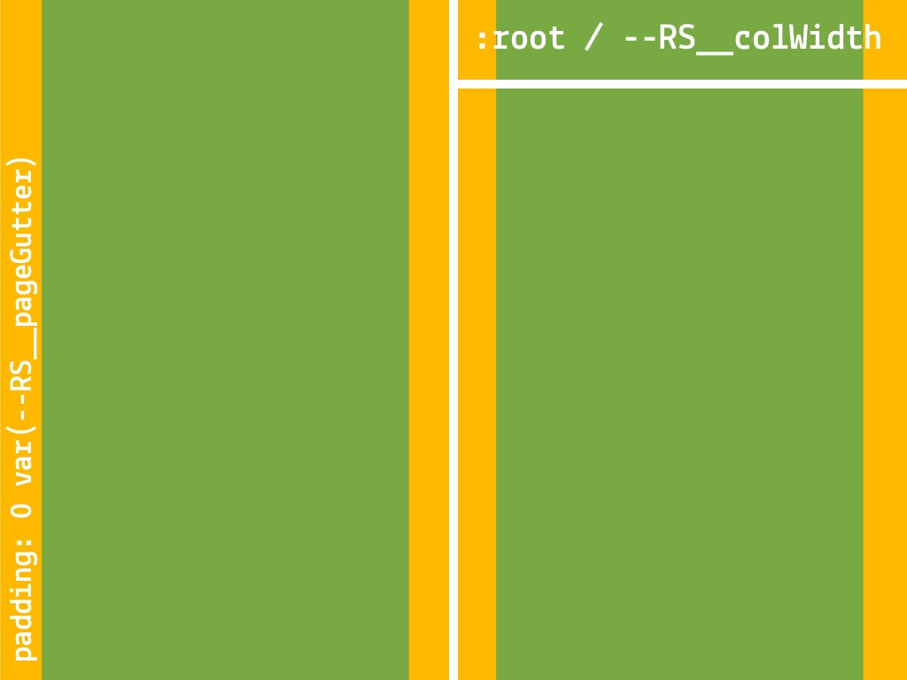
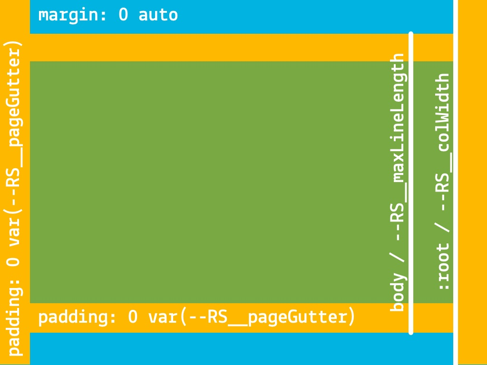

# Inject and paginate EPUB contents

[Implementers’ doc] [Authors’ info]

## Injection

Depending on the platform and version you’re developing for, contents must be injected into: 

- a web view;
- a chrome view;
- an iframe.

Indeed, we must provide authors with a reliable context in which their styles and scripts are scoped.

### Margins and dimensions

Since we must take viewport units into account, especially `vh` (viewport height), at least the top and bottom margins must be set on this container, and not inside it.

You may also want to set left and right margins on this container so that all margins are equal in the two-column view.

Finally, on larger screens, you’ll have to set dimensions on this container so that it doesn’t become too large.

### Background color

Please note you must deal with the `background-color` outside this container, especially as the user can set reading modes (night, sepia, etc.). In other words, it must be synced with this user setting so that the entire screen is the same `background-color`.

As a friendly reminder, you can allow transparency for the iframe if you’re using one. That should help deal with `background-color` at the global level.

```
<iframe src="source.xhtml" allowtransparency="true"></iframe>
```

Then set the `--RS__backgroundColor` variable to `transparent` in `ReadiumCSS-base.css`, although you will have to modify the current user settings stylesheet so that it can work this way.

## Pagination

Contents are paginated using [CSS multicolumns](https://www.w3.org/TR/css3-multicol/), for several reasons: 

- [it’s been cross-platform for a long time](http://caniuse.com/#feat=multicolumn);
- it’s responsive;
- it’s tried and tested;
- it brings some kind of interoperability since it has been used by a lot of Reading Systems and authors have been designing against them.

### Default

Pagination is responsive by default, which means it is using relative values in order to adapt layout to the viewport and the current font size.

We’ve chosen this approach since it appears setting everything in pixels is more likely to create rounding errors and rendering issues (e.g. cut-off text) than letting the rendering engine deal with relative units on its own.

The responsive design provides other benefits. For instance, if the reader is using an iPad in landscape mode and sets a bigger font size, the two-column view will automatically switch to a single-page view if needed.

You can also limit line-length by setting a `max-width` for `body`.

Please note a user setting for the number of columns has been designed so that users can set the layout as they wish.

### The RS owns :root and part of body

Since we must inject contents and columns are implemented at the `:root` level (i.e. `html`), the Reading System owns the entire styling for this selector.

Font size is an important metric since the responsive design relies entirely on `rem` (root `em`) so this style must be enforced by any means necessary.

For `body`, we own: 

- `overflow`;
- sizing: `(min-|max-)width`, `(min-|max-)height`, `box-sizing`;
- spacing: `margin` and `padding`.

You can control horizontal margins in several ways: 

1. using `column-gap` and `padding` for `:root`;
2. using `column-gap` and `margin` for the web view/chrome view/iframe;
3. using `padding` for `:root` and/or `body`.

Please note that when using `padding`, you must take it into account when sizing `:root` and/or `body`. Their widths contain the padding set for the element.

### The auto pagination model

By default, responsive columns are built into Readium CSS, which means the layout will automatically switch from a single page to a two-column spread depending on: 

1. the size of the viewport (by default, the minimum `width` is `60em` or the mobile device is in landscape orientation);
2. the `font-size` currently set by the user.

The spread will consequently switch to a single page once the user sets a `font-size` which is too large for two columns.

The following illustrations are the two models you’ll have to deal with.



A single page is just a column which can grow to the entire width of the web view/iframe since it is declared for `html`.

Page margins are part of `body`, hence `--RS__maxLineLength`. Contents are centered using the `auto` value for `body` margins.



In the spread model, i.e. two columns, the `--RS__colWidth` is a floor: once the minimum width available (viewport) can’t contain 2 columns (the value is computed from the `font-size` user setting), we switch to the single page model.

For instance, if `--RS__colWidth` is `20em` and the `font-size`, `100%` (`16px`), then the floor is `320px`. If 2 columns can fit in the viewport, the spread model is applied. If they can’t, the page model is applied. Hence, if the user sets the `font-size` at `200%` (`32px`), the floor is `640px`, which means the viewport should be at least `1240px`-wide to apply the spread model.

Since we still limit line-length in the spread model, you might want to limit the web view/iframe size so that you don’t end up with wide gaps on large screens (or add `padding` to `:root`, and take it into account when scrolling).

#### Variables you can set

Please note those variables’ value can be redefined using media queries. You don’t need to redeclare entire declarations.

* * *

```
--RS__colWidth
```

The optimal column’s width. It serves as a floor in our design.

It must not be set in `rem` as there is currently a bug with this unit in some implementations (the `em` unit is fine).

* * *

```
--RS__colCount
```

The optimal number of columns (depending on the columns’ width).

* * *

```
--RS__colGap
```

The gap between columns. It must be set in pixels so that it won’t resize with font size. 

You must account for this gap when scrolling.

* * *

```    
--RS__pageGutter
```

The horizontal page margins. It must be set in pixels so that it won’t resize with font size.

* * *

```
--RS__maxLineLength
```

The optimal line-length. It must be set in `rem` in order to take `:root`’s `font-size` as a reference, whichever the `body`’s `font-size` might be.

### Right-to-left progression

The auto pagination model will take care of itself if the correct `dir` attribute is set on `html` and `body`.

In other words, if `dir="rtl"` is set for both elements, the column-progression will be automatically reversed.

#### When to use the Right-to-left progression

What implementers need to do:

1. check the `page-progression-direction` for the `spine` item;
2. check the language – do not forget there can be multiple `<dc:language>` items;
3. load specific styles for RTL scripts;
4. append `xml:lang` and/or `lang` attribute if it’s missing in XHTML documents;
5. append `dir="rtl"` attributes if they’re missing for both `html` and `body` in XHTML documents;
6. load specific fonts’ lists for user settings, based on the primary language of the publication;
7. add/remove specific user settings, based on the primary language of the publication;
8. Apply the correct `page-progression-direction` (in RTL, next resource is on the left, previous is on the right);
9. change the direction of the toc and at least some pieces of user settings (e.g. `text-align`).

The current implementation is limited to the following combinations:

| Language          | IANA tag | page-progression-direction | dir attribute |
|-------------------|----------|----------------------------|---------------|
| Arabic            | ar       | RTL                        | rtl           |
| Farsi (Persian)   | fa       | RTL                        | rtl           |
| Hebrew            | he       | RTL                        | rtl           |

[IANA Language Subtag registery](https://www.iana.org/assignments/language-subtag-registry/language-subtag-registry).

We may add others at some point in the future. Please feel free to report the languages or scripts missing in this mapping. Please bear in mind a list of default (preferably system) fonts will greatly help to add support for those languages and scripts. See [Default Fonts](../docs/CSS09-default_fonts.md).

Test files can be retrieved from [the Readium CSS’ i18n-samples OPDS feed](https://raw.githubusercontent.com/readium/readium-css/develop/docs/i18n-samples/root.atom).

#### Be cautious, the direction propagates

As explicitly stated in [CSS Writing Modes Level 3](https://www.w3.org/TR/css-writing-modes-3/#principal-flow):

> As a special case for handling HTML documents, if the `:root` element has a `<body>` child element, the principal writing mode is instead taken from the values of `writing-mode` and `direction` on the first such child element instead of taken from the root element.

What this means is that the `dir` attribute (or the `direction` CSS property) set for `body` will override the one set for `html`. Unlike most other CSS properties, which don’t impact the parent element, the `dir` attribute (or the `direction` CSS property) propagates in this very specific case:

```
<html dir="ltr">
  <body dir="rtl">
   <!-- dir="rtl" should be used. -->
```

```
html {
  direction: ltr;
}

body {
  direction: rtl;
  /* rtl propagates to html and overrides ltr.
     You can think of it as a JS event bubbling up if that makes more sense. */
}
```

We MUST consequently force the direction for all documents in the publication, and can’t manage `ltr` documents in a `rtl` publication.

Note: While this isn’t necessarily the case in practice, in Blink, Gecko/Quantum and Webkit, and you can emulate a reversed column-progression for `ltr` documents in a `rtl` publication, this behavior may change in the future.

### The pagination model for vertical writing modes

When publications are in Chinese, Japanese, Korean, and Mongolian, and laid out with a `vertical-*` writing mode, we must switch to a different model since we can’t do a two-column spread.

Indeed, columns are automatically laid out on the `y-axis` (vertical) with such writing modes, and [the behavior of multi-column in orthogonal flows has been deferred to CSS Writing Modes Level 4](https://www.w3.org/TR/css-writing-modes-3/#changes-201512).

We consequently use a “Fragmented Model”, as it differs significantly from the “Pagination Model”, especially the column-axis.



One can think of the fragmented model as the single page model rotated 90% clockwise. The only difference is that `padding` is added to the `:root` (`html`) element so that text doesn’t run from edge to edge.

Other options have been explored, e.g. a pseudo-algorithm mimicking `margin: auto`, using the `calc()` function, but it proved complex to manage well and raised serious performance issues, especially when resizing the window of a browser with documents making heavy use of `text-direction` and `text-combine-upright`.

#### When to use the fragmented model

What implementers need to do:

1. check the `page-progression-direction` for the `spine` item;
2. check the language – do not forget there can be multiple `<dc:language>` items;
3. load the specific styles for CJK if needed;
4. append `xml:lang` and/or `lang` attribute if it’s missing in XHTML documents;
5. load specific fonts’ lists for user settings, based on the primary language of the publication;
6. add/remove specific user settings, based on the primary language of the publication;
7. Apply the correct page-progression-direction (in RTL, next resource is on the left, previous is on the right).

Here is the correct mapping for combinations resulting in the `vertical-*` writing mode:

| Language              | IANA tag | page-progression-direction | Writing-mode  |
|-----------------------|----------|----------------------------|---------------|
| Chinese               | zh       | RTL                        | vertical-rl   |
| Chinese (Traditional) | zh-Hant  | RTL                        | vertical-rl   |
| Chinese (Taiwan)      | zh-TW    | RTL                        | vertical-rl   |
| Chinese (Hong Kong)   | zh-HK    | RTL                        | vertical-rl   |
| Korean                | ko       | RTL                        | vertical-rl   |
| Japanese              | ja       | RTL                        | vertical-rl   |
| Mongolian             | mn-Mong  | LTR / Default / None       | vertical-lr   |

[IANA Language Subtag registery](https://www.iana.org/assignments/language-subtag-registry/language-subtag-registry).

Test files can be retrieved from [the Readium CSS’ i18n-samples OPDS feed](https://raw.githubusercontent.com/readium/readium-css/develop/docs/i18n-samples/root.atom).

#### When not to use the fragmented model

If a publication doesn’t need to be laid out in a `vertical-*` writing mode, the auto pagination model can be used.

There are still specific styles for CJK Horizontal to load though.

Here is the correct mapping for combinations resulting in the `horizontal-tb` writing mode:

| Language              | IANA tag | page-progression-direction | Writing-mode  |
|-----------------------|----------|----------------------------|---------------|
| Chinese               | zh       | LTR / Default / None       | horizontal-tb |
| Chinese (Simplified)  | zh-Hans  | LTR / Default / None       | horizontal-tb |
| Chinese (Taiwan)      | zh-TW    | LTR / Default / None       | horizontal-tb |
| Chinese (Hong Kong)   | zh-HK    | LTR / Default / None       | horizontal-tb |
| Korean                | ko       | LTR / Default / None       | horizontal-tb |
| Japanese              | ja       | LTR / Default / None       | horizontal-tb |
| Mongolian             | mn-Cyrl  | LTR / Default / None       | horizontal-tb |

[IANA Language Subtag registery](https://www.iana.org/assignments/language-subtag-registry/language-subtag-registry).

#### Be cautious, the writing-mode CSS property propagates

As explicitly stated in [CSS Writing Modes Level 3](https://www.w3.org/TR/css-writing-modes-3/#principal-flow):

> As a special case for handling HTML documents, if the `:root` element has a `<body>` child element, the principal writing mode is instead taken from the values of `writing-mode` and `direction` on the first such child element instead of taken from the root element.

What this means is that the `writing-mode` declared for `body` will override the one declared for `html`. Unlike most other CSS properties, which don’t impact the parent element, `writing-mode` propagates in this very specific case:

```
html {
  writing-mode: horizontal-tb;
}

body {
  writing-mode: vertical-rl;
  /* vertical-rl propagates to html and overrides horizontal-tb.
     You can think of it as a JS event bubbling up if that makes more sense. */
}
```

We MUST consequently force the `writing-mode` for all documents in the publication, and can’t manage `horizontal-tb` documents in a `vertical-rl` publication.

### Patch and safeguards

We’ve designed two extras for pagination: 

1. a patch for HTML5 Suggested Rendering, which takes care of paged media;
2. safeguards, which make sure some elements will be managed as expected by authors in columns.

#### Patch

The HTML5 patch deals with: 

- fragmentation (`widows`, `orphans` and `page-break`);
- hyphenation;
- open type features;
- horizontal margins (pixels have been converted to %);
- normalization of `abbr` and `wbr`.

You can use it with or without pagination, it should not make any difference.

#### Safeguards

Safeguards deal with:

- media sizing (e.g. `img`, `svg`, `audio`, `video`);
- word wrap for long strings (headings and links);
- large table’s overflow.

Once again, you can use it with or without pagination, it should not make any difference.

##### Variables you can set

* * *

```
--RS__maxMediaWidth
```

The `max-width` for media elements i.e. `img`, `svg`, `audio` and `video`.

* * *

```
--RS__maxMediaHeight
```

The `max-height` for media elements i.e. `img`, `svg`, `audio` and `video`.

* * *

```
--RS__boxSizingMedia
```

The box model (`box-sizing`) you want to use for media elements.

* * *

```
--RS__boxSizingTable
```

The box model (`box-sizing`) you want to use for tables.
