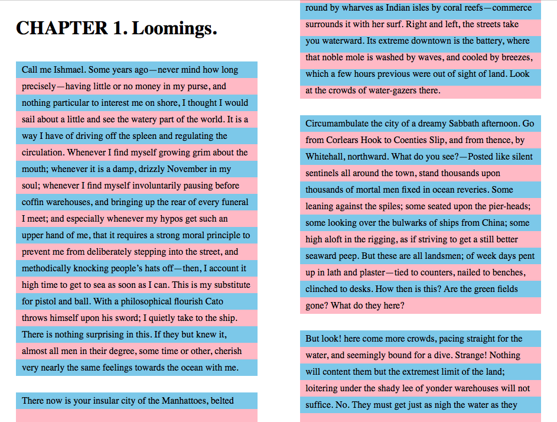

# Features that were considered but not implemented

[Implementers’ doc] [WIP]

This document aims to list features that were considered but not implemented in ReadiumCSS, and clarify the reasons why they weren’t.

It is important to highlight that in most cases, features were not implemented because ReadiumCSS wasn’t the best way to handle them, not because they didn’t have strong use cases. If they were considered for implementation in the first place it is because they were useful, but ReadiumCSS couldn’t really implement them properly, or would have created issues for app developers, etc. 

In other words, this document may also serve as a list of features you could choose to contribute in the various [Readium SDKs and test apps](https://github.com/readium) if they aren’t already implemented.

## Alternate background colors for lines (A11Y)

Related issue: [#39](https://github.com/readium/readium-css/issues/39)

The idea was to add an alternate `background-color` to each line. Since CSS doesn’t have any concept of `nth-line`, you have to cheat and use a `linear-gradient` switching colors based on the current `line-height`.

Unfortunately, this doesn’t work well with fragmentation, and the linear gradient quickly becomes offset.

In addition, CSS is too limited to handle more complex cases such as images and, more generally, more complex structures. So you need JS for a good enough implementation.

## Contrasting text against backgrounds in custom user themes

Related issue: [#74](https://github.com/readium/readium-css/issues/74)

The idea was to handle the text color (using the `calc()` function) when the user picks a background color in custom themes. For instance, text would have been automatically inverted (white instead of black) with a dark background. Obviously, that wouldn’t have prevented the user from picking another text color.

However, implementing this feature in ReadiumCSS would have made it unpredictable for app developers. Indeed, it would have made it difficult for them to synchronize the User Interface, and label the correct text color as active.

This feature should therefore be implemented in the app, as part of the custom themes component. 

## Handle day/night theme based on OSs’ light/dark mode

Related issue: [#75](https://github.com/readium/readium-css/issues/75)

The idea was to switch day/night theme based on the mode the user set in the Operating System’s preferences – using the `prefers-color-scheme` media query.

Once again, implementing this feature in ReadiumCSS would have made it unpredictable for app developers. Without any control over the application of themes, it would have been impossible to sync both the app UI and EPUB theme – resulting in a visible flash of unsynced content –, made it more difficult to handle the theme the user has set, etc.